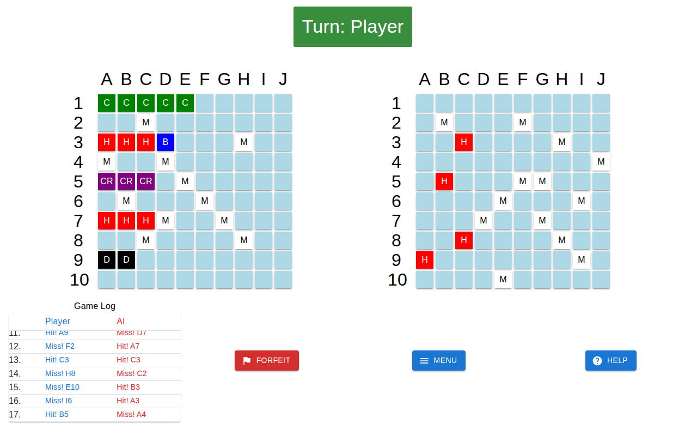
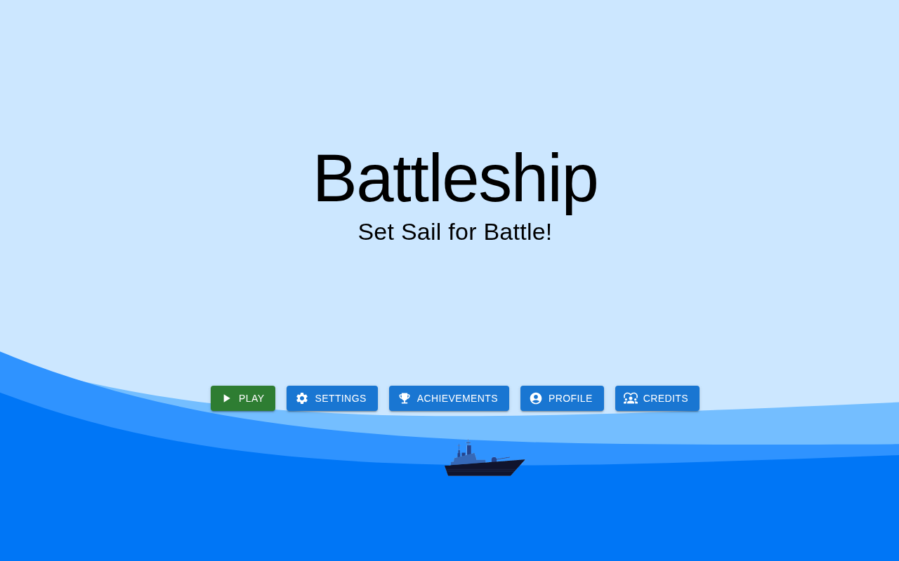

# Battleship: React Board Game with Four AI Opponents

A browser version of the classic *Battleship* board game: place your fleet, then take turns firing at an AI opponent. The AI has four difficulty levels, from a simple hunt-and-target bot up to a probability heat map that models where ships are most likely to be.

Team project (5 people, team *Badger*) · CMPT 276 Introduction to Software Engineering, Simon Fraser University · Summer 2023
Team: Angela Yung, Zachary Chan, Kunlong (Mark) He, Curtis Huang, Kyle Mollard

**Stack:** JavaScript · React 18 · React Router · Material UI · Framer Motion · Howler.js



---

## Features

- **Full game loop:** pick a difficulty, place ships (horizontal or vertical), trade shots, and reach a win or loss screen with a turn-by-turn game log.
- **Four AI difficulties,** each a separate strategy module in [`src/utils/ai_logic/`](%5BAssets%5D/src/utils/ai_logic):

  | Difficulty | Strategy |
  |---|---|
  | Easy | **Seek and hunt:** fires randomly until it scores a hit, then searches the neighbouring squares. |
  | Medium | **Strategic:** after a hit, locks onto a direction and follows the ship's line. |
  | Hard | **Probability heat map:** for every open square, counts how many ways each remaining ship could still fit there, adds a positional bias, and updates the map after every hit or miss. It then fires at the most likely square. |
  | Impossible | **Cheating heat map:** on 10% of turns it fires straight at one of your unhit ship squares, and otherwise uses the Hard heat map. |

- **Player profile and persistence:** stats, 20 achievements, and custom grid colours, all saved in `localStorage`.
- **Polish:** sound effects and background music, menu animations, an in-game help guide, and a settings page.



## Software engineering process

The project followed a phased process, and each phase has its own document:

- **Requirements** ([`requirements.pdf`](requirements.pdf)): scope, user stories, functional and non-functional requirements, and UML [use-case](Battleship_UML_Use-Case_Diagram.png) and [class](Battleship_UML_Class_Diagram.jpg) diagrams.
- **Phase 2: UI prototyping** ([`phase2.pdf`](phase2.pdf)): each member built a UI prototype. The final design merged them around Nielsen Norman usability heuristics (user control, consistency, recognition over recall, and more).
- **Phase 3: Refactoring** ([`phase3.pdf`](phase3.pdf)): identified and fixed code smells. For example, duplicated constants shared by the AI modules moved into one `constants.js`, and a lazy placeholder component was removed.

## Running it locally

```bash
cd "[Assets]"
yarn install        # or: npm install
yarn start          # opens http://localhost:3000
```

Create React App is no longer maintained. If a production build fails on the ESLint config, build with `DISABLE_ESLINT_PLUGIN=true yarn build`.

## Repository layout

```
[Assets]/
├── public/                 # static assets, images, sounds
└── src/
    ├── pages/              # main menu, game, settings, profile, achievements, credits
    ├── scenes/             # game flow: pick difficulty → place ships → battle → win screen
    ├── modules/            # grids, game log, user card
    ├── components/         # shared UI (dialogs, tiles, animations, music)
    └── utils/
        ├── ai_logic/       # the four AI strategies + shared helpers
        └── hooks/          # sound effects, achievements, local storage
```

*Originally developed on SFU's GitHub Enterprise and mirrored here.*
